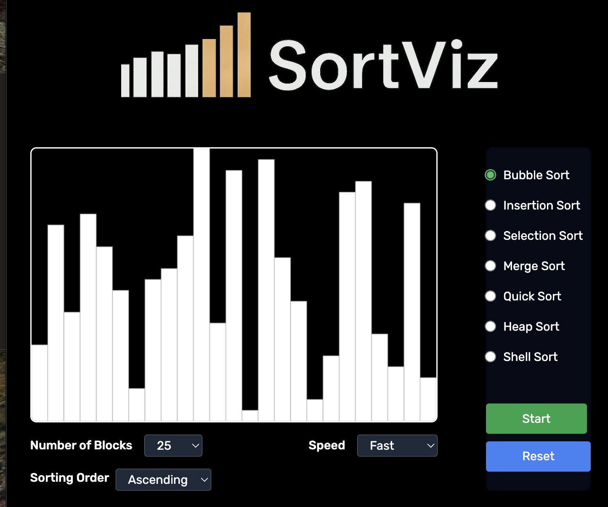
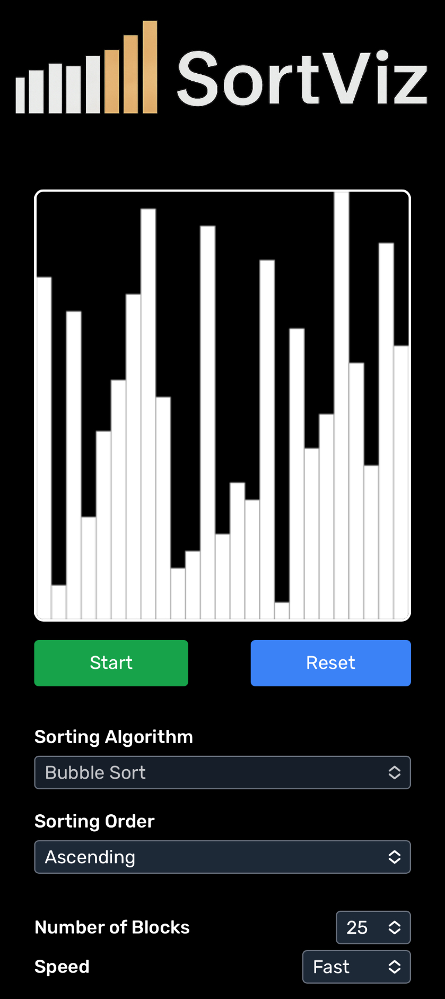

# 🧮 Sort Viz

**Sort Viz** is an interactive React application that visually demonstrates how various sorting algorithms work. It allows users to explore and compare the behavior of different sorting techniques in real time using animated bars (blocks) of varying heights.

---

## 🚀 Features

* 🔢 **Visualizes 7 Sorting Algorithms**:

  * Bubble Sort
  * Selection Sort
  * Insertion Sort
  * Quick Sort
  * Merge Sort
  * Heap Sort
  * Shell Sort

* 🧱 **Block-Based Visualization**: Each element in the array is represented as a vertical block of random height.

* 🎮 **User Controls**:

  * **Speed** of animation
  * **Number of elements** (blocks)
  * **Sorting algorithm**
  * **Sorting order** (ascending or descending)

* 📱 **Responsive Design**: Optimized for all screen sizes (mobile, tablet, desktop).

---

## 📁 Project Structure

```
Sort Viz/
├── src/
│   ├── App.jsx                      # Root app component
│   ├── index.jsx                   # Entry point
│   ├── logic/
│   │   ├── sort.js                 # Sorting algorithm logic
│   │   ├── viz.js                  # Animation and visualization helpers
│   │   ├── block.js                # Block (visual unit) class
│   │   └── blockset.js             # Manages set of blocks and drawing logic
│   ├── components/
│   │   ├── MainPanel.jsx           # Main canvas and layout panel
│   │   ├── VizControlPanel.jsx     # Controls for speed and size
│   │   ├── SortControlPanel.jsx    # Controls for sorting algo and order
│   │   ├── small-screen/
│   │   │   ├── SortControlRow.jsx
│   │   │   └── ActionControlRow.jsx
│   │   └── large-screen/
│   │       └── SortOrderControlRow.jsx
│   ├── store/
│   │   ├── constants.js            # Shared constants (speeds, options)
│   │   └── blockContext.js         # Global state/context for simulation
```

---

## 🛠️ Installation

```bash
git clone https://github.com/lokeshagg13/Sort-Viz.git
cd Sort-Viz
npm install
npm start
```

---

## 📷 Preview

<table>
  <tr>
    <td></td>
    <td></td>
  </tr>
</table>

---

## 🧠 Technologies Used

* React (Functional Components + Hooks)
* HTML5 Canvas
* CSS (Responsive Design with Flex/Grid)
* JavaScript (ES6+)

---

## 📌 Notes

* The app supports pausing and resuming the simulation.
* Sorting is purely for educational visualization—performance is not optimized for large datasets.
* The project emphasizes understanding algorithm behavior rather than raw efficiency.

---

## 📄 License

MIT License
© 2025 Lokesh Aggarwal
